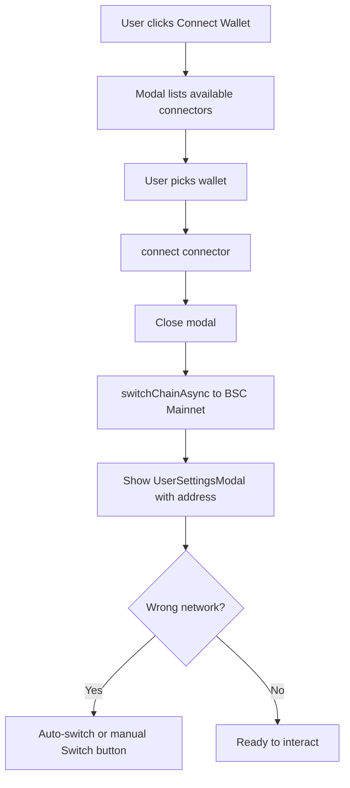

# Connect Wallet & Contract Read/Write

This document describes how wallet connection and smart contract interaction are implemented in this project. The stack is **wagmi v2**, **viem**, **@tanstack/react-query**, and **ethers v5** (for unit conversion only).

---

## Architecture overview

```
app/layout.tsx
  └── WagmiContextProvider          lib/providers/index.tsx
        └── WagmiProvider (wagmiConfig)
              └── QueryClientProvider
                    └── MainLayout
                          └── ConnectWallet / Mint components
```

| File                                   | Role                                                          |
| -------------------------------------- | ------------------------------------------------------------- |
| `lib/config/wagmi.config.ts`           | Chain list and RPC transports                                 |
| `lib/providers/index.tsx`              | Wraps the app with `WagmiProvider` + React Query              |
| `lib/config/contract.ts`               | Contract ABI, address, gas limit, chain IDs                   |
| `components/wallet/connect-wallet.tsx` | Connect / disconnect UI and network enforcement               |
| `components/wallet/mint.tsx`           | Reference implementation for reading and writing the contract |

The app targets **BSC Mainnet** (chain ID `56`). Wrong-network detection and auto-switch logic live in both `connect-wallet.tsx` and `mint.tsx`.

---

## 1. Wagmi setup

### Config

`lib/config/wagmi.config.ts` registers supported chains and HTTP transports:

```ts
import { createConfig, http } from "wagmi";
import { baseSepolia, bsc, mainnet, sepolia } from "wagmi/chains";

export const wagmiConfig = createConfig({
  chains: [mainnet, sepolia, baseSepolia, bsc],
  transports: {
    [mainnet.id]: http(),
    [sepolia.id]: http(),
    [baseSepolia.id]: http(),
    [bsc.id]: http(),
  },
});
```

No custom connectors are defined. wagmi v2 discovers injected wallets (MetaMask, etc.) automatically via `useConnect().connectors`.

### Provider

`lib/providers/index.tsx` must wrap any component that uses wagmi hooks:

```tsx
<WagmiProvider config={wagmiConfig}>
  <QueryClientProvider client={queryClient}>{children}</QueryClientProvider>
</WagmiProvider>
```

This is mounted in `app/layout.tsx` so the entire app has access to wallet state.

---

## 2. Connect wallet

**Component:** `components/wallet/connect-wallet.tsx`

**Used in:** `components/Header.tsx`, `components/wallet/mint.tsx`

### Flow



### Disconnected state

When `useAccount().isConnected` is false, the component renders a **Connect Wallet** button that opens a modal. Available wallets come from `useConnect().connectors` and are rendered as buttons.

```tsx
const { connect, connectors } = useConnect();

const handleWalletSelect = async (connector) => {
  await connect({ connector });
  setShowWalletModal(false);

  // Switch to BSC after a short delay (some wallets ignore chainId on connect)
  setTimeout(async () => {
    await switchChainAsync({ chainId: bsc.id });
  }, 100);
};
```

### Connected state (`UserSettingsModal`)

Once connected, the component switches to a profile UI:

- **Desktop:** Radix `Popover` with address, network name, disconnect
- **Mobile:** `Drawer` with the same info

Hooks used:

| Hook               | Purpose                         |
| ------------------ | ------------------------------- |
| `useAccount()`     | `address`, `isConnected`        |
| `useChainId()`     | Current chain                   |
| `useChains()`      | Resolve chain name from ID      |
| `useSwitchChain()` | Prompt wallet to change network |
| `useDisconnect()`  | Disconnect wallet               |

### Network enforcement

A `useEffect` watches `chainId` and automatically calls `switchChainAsync({ chainId: bsc.id })` when the user is on the wrong network. If auto-switch fails (user rejection), a **Wrong Network** banner with a manual **Switch to BSC Mainnet** button is shown.

---

## 3. Contract configuration

**File:** `lib/config/contract.ts`

Exports used by mint and any future contract UI:

| Export             | Description                                 |
| ------------------ | ------------------------------------------- |
| `CONTRACT_ABI`     | Full JSON ABI of the Tigerians NFT contract |
| `CONTRACT_ADDRESS` | Deployed contract address (`0x…`)           |
| `GAS_LIMIT`        | Suggested gas limit for writes (`145000`)   |
| `CHAINS`           | Hex and integer chain ID helpers            |

Always import address and ABI from this file rather than hardcoding them in components:

```ts
import { CONTRACT_ABI, CONTRACT_ADDRESS } from "@/lib/config/contract";
```

---

## 4. Reading from the contract

Reads are **view/pure calls** — no wallet signature or gas required. They run through wagmi’s `useReadContract` hook, which uses the connected chain’s RPC transport from `wagmiConfig`.

### Basic read (no arguments)

```tsx
const { data: isPublicSale, isLoading } = useReadContract({
  address: CONTRACT_ADDRESS,
  abi: CONTRACT_ABI,
  functionName: "isPublicSale",
});
```

### Read with arguments

Pass `args` as a tuple matching the Solidity function parameters:

```tsx
const { address } = useAccount();

const { data: balanceOf, refetch: refetchBalance } = useReadContract({
  address: CONTRACT_ADDRESS,
  abi: CONTRACT_ABI,
  functionName: "balanceOf",
  args: [address || "0x0000000000000000000000000000000000000000"],
});
```

### Reads used in `mint.tsx`

| `functionName`               | Purpose                                  |
| ---------------------------- | ---------------------------------------- |
| `isPublicSale`               | Public sale vs presale mode              |
| `getMintPrice` / `mintPrice` | Price per NFT (fallback if one is unset) |
| `supply`                     | Max supply                               |
| `paused`                     | Whether minting is paused                |
| `balanceOf`                  | User’s NFT count                         |
| `presaleMaxNFTPerWallet`     | Presale per-wallet cap                   |
| `publicSaleMaxNFTPerWallet`  | Public sale per-wallet cap               |
| `totalMinted`                | Total minted so far                      |

### Refetching after a write

After a successful transaction, call `refetch()` from the read hook to refresh on-chain state:

```tsx
await refetchBalance();
await refetchTotalMinted();
```

---

## 5. Writing to the contract

Writes require a **connected wallet** on the **correct chain**. They send a transaction the user must approve in their wallet.

### Setup hooks

```tsx
const { data: txHash, writeContract, isPending } = useWriteContract();

const {
  isLoading: isConfirming,
  isSuccess: isConfirmed,
  isError: isTxError,
  error: txError,
} = useWaitForTransactionReceipt({ hash: txHash });
```

| Hook                             | Purpose                                  |
| -------------------------------- | ---------------------------------------- |
| `useWriteContract()`             | Submit the transaction; returns `txHash` |
| `useWaitForTransactionReceipt()` | Poll until the tx is mined               |

### Public sale mint (payable)

`mint(uint256 quantity)` — send BNB as `value`:

```tsx
import { ethers } from "ethers";

const priceInBNB = Number(ethers.utils.formatEther(effectivePrice.toString()));
const totalPrice = priceInBNB * mintQuantity;

writeContract({
  address: CONTRACT_ADDRESS,
  abi: CONTRACT_ABI,
  functionName: "mint",
  args: [BigInt(mintQuantity)],
  value: BigInt(ethers.utils.parseEther(totalPrice.toString()).toString()),
});
```

### Presale mint (payable + merkle proof)

`preMint(uint256 quantity, bytes32[] proof)`:

```tsx
writeContract({
  address: CONTRACT_ADDRESS,
  abi: CONTRACT_ABI,
  functionName: "preMint",
  args: [BigInt(mintQuantity), whitelistProof],
  value: BigInt(ethers.utils.parseEther(totalPrice.toString()).toString()),
});
```

### Pre-write checks (recommended)

Before calling `writeContract`, `mint.tsx` validates:

1. Wallet is connected (`address`)
2. Chain is BSC Mainnet (`chainId === bsc.id`) — switch if needed
3. Contract is not `paused`
4. Price data is loaded
5. User is within per-wallet mint limits
6. For presale: whitelist proof is valid

### Handling confirmation and errors

Use effects on `isConfirmed` and `isTxError` rather than assuming success when `writeContract` returns:

```tsx
useEffect(() => {
  if (isConfirmed && minting) {
    setMinting(false);
    // show success, refetch reads
  }
}, [isConfirmed, minting]);

useEffect(() => {
  if (isTxError && minting) {
    setMinting(false);
    // show txError.message
  }
}, [isTxError, minting, txError]);
```

---

## 6. Adding a new contract interaction

### Read a new view function

1. Confirm the function name and parameter types in `CONTRACT_ABI`.
2. Add a `useReadContract` call with matching `functionName` and `args`.
3. Use `data`, `isLoading`, and `refetch` in your UI.

```tsx
const { data: owner, isLoading } = useReadContract({
  address: CONTRACT_ADDRESS,
  abi: CONTRACT_ABI,
  functionName: "owner",
});
```

### Write a new function

1. Confirm the function signature in the ABI.
2. Ensure the wallet is connected and on BSC Mainnet.
3. Call `writeContract` with correct `args` and `value` (if payable).
4. Track `txHash` with `useWaitForTransactionReceipt`.
5. Refetch affected reads after `isConfirmed`.

```tsx
writeContract({
  address: CONTRACT_ADDRESS,
  abi: CONTRACT_ABI,
  functionName: "yourFunctionName",
  args: [arg1, arg2],
  // value: BigInt(...)  // only for payable functions
});
```

---

## 7. Dependencies

```json
"wagmi": "^2.17.5",
"viem": "~2.37.9",
"@tanstack/react-query": "^5.90.2",
"ethers": "^5.8.0"
```

- **wagmi / viem** — wallet connection, reads, writes, chain switching
- **React Query** — caching and refetch for contract reads (required by wagmi)
- **ethers v5** — `formatEther` / `parseEther` for BNB amounts in the mint flow

---

## 8. Environment & deployment notes

- Set `CONTRACT_ADDRESS` in `lib/config/contract.ts` to the live BSC Mainnet deployment before production.
- `NEXT_PUBLIC_THIRDWEB_CLIENT_ID` is required for `ThirdwebProvider` in the layout; wallet connection itself uses wagmi, not thirdweb’s connect API.
- For local/dev contract testing, see `components/wallet/mint-dev.tsx` — same read/write patterns as `mint.tsx`.
